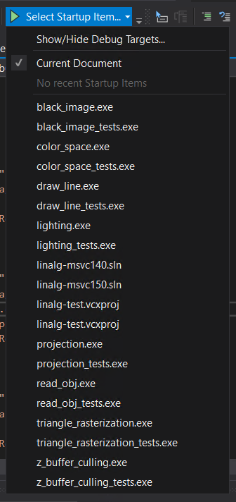

# CG Assignment 1

### Solutions for **Computer Graphics in Game Development** course assignment.

<p align="center">
    
     
</p>

> NOTE: shadow mapping is not implemented yet

## Building
1. Clone this repo
```batch
cd your-projects-folder
git clone https://github.com/modbrin/inno-cg
```

2. Pull dependencies
```batch
git submodule update --init --recursive
```

3. Open in Visual Studio (tested with VS2019+):
A) Using bundled CMake (recommended)
* Open Visual Studio
* Select `Open a local folder`
* Navigate to and open project folder\
At this point CMake project will be recognized by VS
(if not, open CMakeLists.txt and click `Generate` in notification on top)
* Select desired executable and run:

<p align="center">
  
</p>

* If elements are not showed or they fail to work, check out `(project root)/.vs/launch.vs.json` file to be same as in repository.

B) Using Premake5
* Get Premake from https://premake.github.io/
```batch
cd inno-cg
premake5 vs2019
```
* Open generated solution